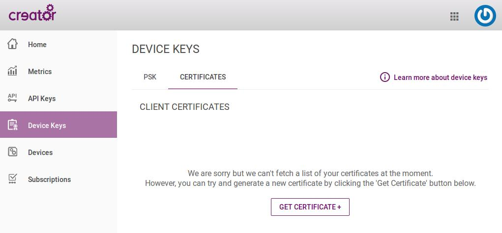
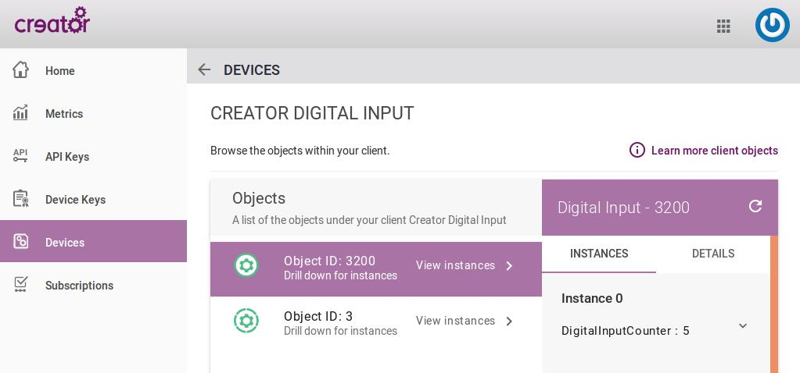

# w1-switchcounter
----

In this project we will connect a Ci40 to Device Server and log the number of times a button is pressed. This number will be visible on the Developer Console web interface.

Areas covered in this project include:

* Cross-compiling a package for OpenWrt using the SDK
* LetMeCreate library
* Awalwm2m
* Device Server
* Developer Console

---

## Assumptions

This guide assumes that you have flashed the latest Ci40 Creator image onto your Ci40 [Instructions](https://docs.creatordev.io/ci40/guides/openwrt-platform/#system-upgrade) and that you have completed the steps in the [quick start guide](../../guides/quick-start-guide). On Ci40, you may need to install awalwm2m and letmecreate (opkg update && opkg install letmecreate awalwm2m) if you are not using a Creator image.

It is also assumed that you have an Ubuntu 16.04 PC/VM (other versions/distros may work, but this cannot be guaranteed).

## Build Environment Setup Instructions

Download the following script into the desired folder on your Linux PC/VM:

[buildenvironment.sh](https://gist.github.com/MattAtkinson/3ee477c92ff10c3a246c3ab27d864b58)

and run it with:

<pre>
$ chmod +x buildenvironment.sh
$ ./buildenvironment.sh
</pre>

This script is stored on gist so that you can see the code and manually run the setup if you prefer.

Once the script has completed its install procedure, you will have an openwrt/ folder (containing the Creator OpenWrt SDK) and a custom/ folder (containing the workshop code and makefiles) in the same directory.

### Building your Application

Run the following command in your new openwrt folder:
<pre>
$ make package/w1-switchcounter/compile
</pre>

There are normally a lot of warnings created at the start of the build process, but they are not a concern. This first build will take longer than normal, as the dependencies (such as awalwm2m) must be built first. Future builds of the same application will be much faster.

Once the build is complete, you can find the ipk file in the bin/pistachio/packages/custom folder.

### Securely Provisioning to Device Server and Running the Application

Before running the example, you need to create a certificate and then copy the certificate and application installer to Ci40. The certificate securely connects Ci40 to your user account on the Device Server.

To get a certificate, go to [console.creatordev.io](http:/console.creatordev.io) and create an account (or log in). Once logged in, click on "Device Keys" in the left sidebar and then change to the "Certificates" tab an click "Get Certificate+" button. Take a copy of this certificate and save it to a file called "creatorworkshop.crt".

You now need to get both the certificate and ipk files onto your Ci40. There are numerous ways to do this (usb/microsd/scp/fileserver etc.) but we will use scp in this example. Check your Ci40's IP address by running 'ifconfig' in its terminal, then run the following on your build PC (using your Ci40 ipaddress and the paths to the files):

<pre>
$ scp path/to/switch_1.0.0-1_pistachio.ipk root@yourci40ipaddress:/
$ scp path/to/creatorworkshop.crt root@yourci40ipaddress:/etc/config
</pre>

Once you've copied the files, you can install your package and run the application on Ci40 by running the following in its terminal:

<pre>
/# opkg install switch_1.0.0-1_pistachio.ipk
/# bin/switch
</pre>

### Viewing the Data on the Developer Console

[The Developer Console](http://console.creatordev.io) provides and interface to view the devices connected to Device Server. With your application running on Ci40, navigate to the "Devices" page. Select the device, select Object ID: 3200, and you will see the number of times the button (SW1 on Ci40) has been pressed. You can refresh this value using the on-screen refresh button.

## Adding a Temperature Sensor

A simple way to learn more about how the code works is to edit it to add more features. The parts of the code you have to change will introduce important concepts when writing awa code for Ci40. To do this we will use a Thermo3 Click board (connected to MikroBUS port 1) to make temperature reading visible on the Developer Console instead of the switch counter.

First, you will want to copy and rename your switch.c file to keep a backup.

There are 2 things you need to change to switch from counting switch presses to reading temperature. First we need to change the IPSO object definition, and secondly add the logic to read the sensor.

### Changing IPSO Object definition

IPSO is a standard to allow interoperability between LWM2M devices. If you look under "Devices" on the [Developer Console](http://console.creatordev.io) you will find a tab for Object Definitions. There you can see that we have listed all the different IPSO standard objects and resources. If you would like a primer on LWM2M, view our introductory guide [here](../../../deviceserver/guides/lwm2m-overview). 

If you look up Digital Input on this list you will see some key pieces of information:

* ObjectID - 3200
* Digital Input Counter - ResourceID - 5501
* Digital Input Counter - Data Type - Integer

If you then look up Temperature instead of Digital Input you will see:

* ObjectID - 3303
* Sensor Value - ResourceID - 5700
* Sensor Value - Data Type - Float

Looking at the switch.c code, you will see that 3200 and 5501 are used in several places. This could be put into a variable, but for the purposes of this workshop, having the numbers makes it clearer where the objectID and ResourceID are used.

Change all the instances of 3200 to 3303, and all instances of 5501 with 5700.  That takes care of the first 2 key points. The third is that Temperature IPSO object uses a float rather than an integer. To change this you need to edit the following line:

<pre>
AwaStaticClient_DefineResource(awaClient, 3200, 5501, "Counter",AwaResourceType_Integer, 0, 1, AwaResourceOperations_ReadOnly);
</pre>

to have AwaResourceType_Float instead of AwaResourceType_Integer. This will correctly set up the Resource to expect a float value. Change the following line within the counter definition struct:

<pre>
int Totalcount;
</pre>

to

<pre>
AwaFloat Temperature;
</pre>

Also replace all instances of Totalcount with Temperature.

Technically that is all that you need to do from an Awa perspective, however all the names are still set to "Counter" related words, so you can change these if you would like to, though functionally it will make no difference.

### Reading Temperature Values using LetMeCreate

The LetMeCreate library is designed to make interacting with peripherals and on-board i/o as easy as possible. The switchcounter example makes use of it to use the switch. We first need to remove all the switch logic, and then add in the temperature sensor code. This temperature sensor code is based on the example [here](https://github.com/francois-berder/LetMeCreate/tree/master/examples/thermo3) in the library itself.

First remove the callback function:

<pre>
/**Switch Callback Function**/
static int currentcount = 0;

static void addcount(void)
{
    currentcount++;
    counter[0].Totalcount = currentcount;
    AwaStaticClient_ResourceChanged(awaClient, 3200, 0, 5501);
}
</pre>

and remove the inits form within the main():

<pre>
    /**Init Switch and Callback**/
    switch_init();
    switch_add_callback(SWITCH_1_PRESSED, addcount);
</pre>

With those 2 pieces of code removed, all the switch related code is gone.

Replace the while(1) loop within the main() with this:

<pre>
    int instance = 0;
    i2c_init();
	i2c_select_bus(MIKROBUS_1);

    while (1)
    {
        AwaStaticClient_Process(awaClient);
	    
	    //LetMeCreate Thermo3 Click Read
        float temperature = 0.f;

	    thermo3_click_enable(0);
	    thermo3_click_get_temperature(&temperature);
	
        //Update LWM2M resource
        counter[instance].Temperature = temperature;
        AwaStaticClient_ResourceChanged(awaClient, 3303, 0, 5700);

        //Delay between temperature readings
        sleep(2);           
    }
</pre>

_Note that if you changed the variable names, counter[instance] will need to be changed to match your new name._

This block of code is 'borrowed' from the LetMeCreate library examples [here](https://github.com/francois-berder/LetMeCreate/tree/master/examples/thermo3). We've modified it slightly to add the lwm2m resource update and add a delay between readings. 

You should now be able to build the project exactly as before and copy the ipk file to Ci40.

Note that to install the new ipk you will have to run:

<pre>
/# opkg remove switch && opkg install switch_1.0.0-1_pistachio.ipk
</pre>

